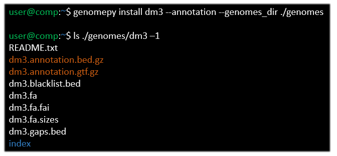
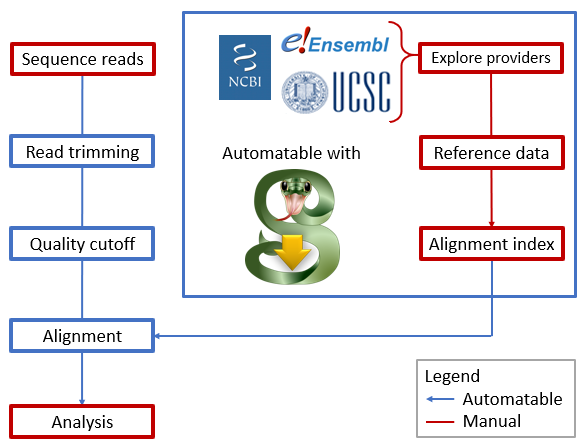

## Introduction
As high-throughput sequencing matured over the past decade and a half, the size and amount of sequencing data has exploded.
Over the past five years, the number of datasets published on the NCBI GEO database increased by an average of 2000 per year, while the number of samples increased by 100.000 per year @pmc:PMC3531084.
This explosion of data highlights the need for scalable, robust and automatable methods for data processing and analysis.

A large amount of bioinformatics tools have been created to facilitate this process, including (pre)processing tools, analysis tools and workflow managers to link these tools together (such as the snakemake wrapper @https://snakemake-wrappers.readthedocs.io/en/stable/wrappers/genomepy.html).
Together, this allows the human component to shift towards management, reducing both human labor and error.
However, not all input data can be obtained fully automatic.
Notably the genomic data, which includes the genome assembly, gene annotation and derived files.
<!--  -->
<!-- In the case of genomic sequencing preprocessing for instance, a genome assembly and gene annotation are required for sequence alignment. # TODO: example -->
<!-- Likewise, downstream analysis require genomic data, such as the genome assembly or indexes derived therefrom. # TODO: example -->
<!--  -->
<!--  -->
<!--  -->
<!-- problem one: multiple sources with different output assembly -->
<!-- problem two: choice of assembly is important for you -->
<!--  -->
<!-- solution one: learn all the differences -->
<!-- solution two: get the one that fits you -->
<!--  -->
These data can be obtained from a variety of different providers.
These include three major genome providers, Ensembl @https://doi.org/10.1093/nar/gkz966, UCSC @doi:10.1101/gr.229102 and NCBI @pmc:PMC308837,
and many niche providers, such as flybase @https://doi.org/10.1093/nar/gky1003, wormbase @https://doi.org/10.1093/nar/gkz920 or xenbase @doi:10.1093/nar/gkx936.
<!-- Providers range from individual organisations to collaborators in larger projects, such as the ENCODE project, # TODO: source -->
<!-- each with their workflow for generating genomic data.  -->
<!--  -->
<!-- Ensembl uses their in-house workflow to add or update genomes and gene annotations in a three-month production cycle @https://ensembl.org/info/about/release_cycle.html. -->
<!-- As a results, Ensembl provides detailed gene annotations on mature genome assemblies that update frequently. -->
<!-- Downside to Ensembl system include their chromosome naming scheme (e.g. "1" for chromosome 1) which clashes with several common bioinformatics tools, or that prior releases of genomic data are buried in their ever growing archive. -->
<!--  -->
<!-- UCSC hosts and maintains a modest set of reference genomes. -->
<!-- Gene annotations for these genomes are generated through a variety of methods, including the Ensembl and NCBI workflow, as well as their own. -->
<!-- However, not every version of these gene annotations conforms to the output format. -->
<!--  -->
<!-- The NCBI database accepts submissions from the Genome Reference Consortium as well as individuals. -->
<!-- In addition to reference assemblies by the reference consortium, uploads by individual groups often provide a trove of different strains per species. -->
<!-- For instance, 946 different strains of Homo sapiens and 848 strains of Saccharomyces cerevisiae are available from NCBI. -->
<!-- As a result of the open submission system, NCBI updates frequently, and often provides the latest version of an assembly before the other providers do. -->
<!-- However, as an upload may contain either genome assembly, gene annotation, or both, the assembly data can be incomplete, and of varying levels of maturity. -->
<!--  -->
<!-- Furthermore, there are many species specific providers, such as flybase @https://doi.org/10.1093/nar/gky1003, wormbase @https://doi.org/10.1093/nar/gkz920 or xenbase @doi:10.1093/nar/gkx936. -->
<!--  -->
<!--| Provider | Assemblies |-->
<!--|----------|------------|-->
<!--| Ensembl bacteria (excluded in the other number) | 43778 |-->
<!--| NCBI bacteria    (included in the other number) | 28631 |-->
<!--  -->
<!-- | Provider | Assemblies | -->
<!-- |----------|------------| -->
<!-- | UCSC |  213 | -->
<!-- | Ensembl |  1741 | -->
<!-- | NCBI | 878821 | -->
<!--  -->
<!-- Table: Available genome assemblies per provider. -->
<!-- Estimated by querying the provider REST API (assembly summaries for NCBI) for all unique assembly names. -->
<!-- Ensembl genomes are excluding 43778 bacteria genomes not available programmatically. -->
<!-- {#tbl:providers} -->
<!--  -->
Each provider has a different method of generating genome assemblies and gene annotations, which can affect available data formats, naming schema, information density, as well as availability, accessibility and relevance.
Take the major providers:
Ensembl hosts a large database of curated genomes, most of which are actively maintained.
They provide gene annotation in commonly used data formats (GTF, GFF3 and BED12), and their GTF files contain the most metadata af the mayor providers.
However, Ensembl uses a chromosome naming scheme that clashes with several bioinformatics tools (e.g. "1" for chromosome 1).
<!-- Take the major providers: -->
<!-- Ensembl regularly updates their curated genome data with a rich and consistent data format, but with a chromosome naming scheme that clashes with several bioinformatics tools (e.g. "1" for chromosome 1). -->
NCBI hosts the largest database by accepting submissions from the Genome Reference Consortium as well as from individuals.
As a result, the database provides a trove of data with varying quality and completeness.
Finally, UCSC hosts and maintains a modest set of reference genomes, with gene annotations derived from multiple pipelines for most.
However, their gene annotations have inconsistent data formats, which also clashes with bioinformatics tools (e.g. the gene names and gene identifiers are mixed).
These differences impact the compatibility of the reference data with research tools @https://doi.org/10.1186/s12864-015-1308-8, other reference databases and other research.
Therefore, the choice of provider and reference data is of significant importance.

Making an informed decision requires an overview of available options.
This is achieved by determining which providers host the genomic data of interest, then which genomic data is most suitable, then downloading and processing the genomic data and finally starting your analysis.
<!-- Such an overview could be obtained by checking each provider separately, then download and process the data manually. -->
Performing these steps manually creates room for human error in the locating, processing and reporting of these steps as well as the reasoning behind them.
For the sake of sanity and reproducibility, it would be better if this could be done in a standardized system.

In order to assist in searching through genome providers for, and the processing of genomic data, we developed genomepy.
Using the search function one can get an overview of all genomes containing the search term in their name, description or accession identifier, as well as all genomes matching a taxonomy identifier.
The search function can provider this overview for each of the majors providers, Ensembl, UCSC, NCBI or all three.
Once a selection is made the genome and gene annotations can be downloaded and prepared for use with the install function (figure {@fig:flow}).
The install function automatically performs processing of the genomic data, including genome indexing with pyfaidx @https://doi.org/10.7287/peerj.preprints.970v1, generating support files (chromosome sizes and sequencing gaps), matching chromosome names between genome and gene annotation, and optional aligner index generation).
Using the command line interface will automatically log which of these features is used.
Once downloaded genomepy installs the path to genome FASTA file into command line variables, for quick reference in downstream tools.
Using the Python application programming interface the genomepy Genome object can be used to similarly access the metadata of the installed genomic data, such as the location and content additional data files (chromosome sizes, gene annotation files).
Both interfaces are develop for incorporated in workflows to automate the downloading and processing steps.

{#fig:flow height="400px" width="600"px}

{#fig:code height="350px" width="500"px}

<!--  -->
<!-- To this end we developed genomepy. -->
<!-- Genomepy is a tool with both command line interface and Python application programming interface, which can be called to search one or all three providers at once. -->
<!-- Using the search function one can get an overview of all genomes containing the search term in their name, description or accession identifier, as well as all genomes matching a taxonomy identifier. -->
<!-- Once a selection is made the genome and gene annotations can be downloaded and prepared for use with the install function. -->
<!-- This includes automatic preparation for aligners (genome indexing with pyfaidx @https://doi.org/10.7287/peerj.preprints.970v1, generating support files (chromosome sizes and gaps), matching chromosome names between genome and gene annotation and optional aligner index generation). -->
<!-- Which of these features is used is automatic logged for reproducibility. -->
<!-- Because of the multiple interfaces, genomepy can be used in workflows to automate these steps. -->
<!--  -->
<!-- {#fig:workflow_w_genomepy height="500px" width="500"px} -->

## Related Work
Ensembl, UCSC and NCBI all support downloading from their individual databases via accessible FTP archives, web portals, and REST APIs.
To access these databases programmatically, there exists several external tools, such as the ncbi-genome-download tool @https://github.com/kblin/ncbi-genome-download and ucsc-genomes-downloader @https://pypi.org/project/ucsc-genomes-downloader.
However, to our knowledge no tool exists that can consistently search or download from all three major genome providers.

There are several existing tools for reproducibly sharing reference data between projects.
These data management tools accept reference data and derived assets such as aligner indexes from any source, such as iGenomes @https://support.illumina.com/sequencing/sequencing_software/igenome.html, refGenie @https://doi.org/10.1093/gigascience/giz149 and Go Get Data @https://doi.org/10.1101/2020.09.10.291377.
These tools excel in their ability to reproducibly share data, a feature which is not present in genomepy, and can be used to obtain and manage previously generated data with ease.
However, these tools require the user to supply the reference data to any new assembly (such as non-model organisms), new assembly version (such as the latest patch of the human genome) or in some cases assets (such as an aligner index not present in the hosted data).
<!-- For these situations, data management tools would be an excellent extension to genomepy. -->
<!--  -->
<!-- In several cases the reference data may not be ready for direct downstream use. -->
<!-- For instance, many assemblies do not contain gene annotations in the correct format for splice-aware aligners. -->
<!-- Furthermore, many gene annotations have contig (chromosomes and scaffolds) names that do not match the names in the reference genome. -->
<!-- Additional steps, including compatibility checks and potentially processing, are required. -->
<!-- Many tools exist to perform these actions, most noteably the UCSC gene annotation conversion tools. -->
<!-- However, it should not bear mentioning that and automated checklist but would be more efficient that a manual one. -->
<!--  -->
<!-- We conclude that there is a need for a tool that can provide an overview of the choices of reference data available, can obtain the specified data, and perform the processing required to utilize the data downstream. -->
<!-- Genomepy was created to fit this need, and does so for both automated and human-supervised workflows. -->

We conclude that there is a need for a tool that can assist in obtaining and preparing genomic data for downstream analysis.
This includes providing an overview of available choices, downloading the data, error checking (and if possible correcting) genome and gene annotations, and outputting data types commonly used in bioinformatics tools.
Genomepy was created to fit this need for both automated and human-operated workflows. Additionally, genomepy provides a framework that facilitates the downstream use of the data.
