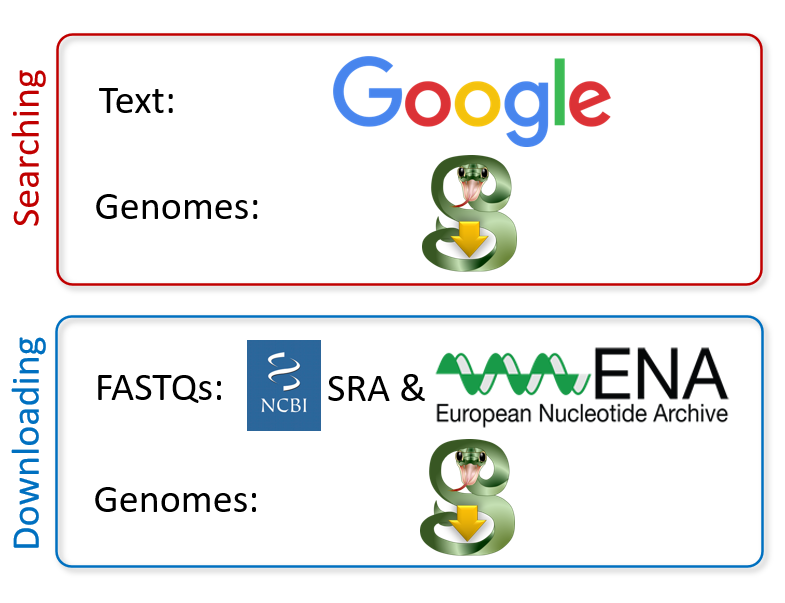

{##

    To create the webpage locally, run `build/run_on_localhost.sh` and clock the http link.
    
    Aim: up to 2 pages; this is approx. 1,300 words or 1,000 words plus one figure.
##}

## Introduction
Data analysis is increasingly important in biological research.
Whether you are analyzing gene expression in two samples or protein binding motifs in genome atlases, you will need external information such as a reference genome or a gene annotation.
For these types of data, there are three major providers: Ensembl @https://doi.org/10.1093/nar/gkz966, UCSC @https://doi.org/10.1101/gr.229102 and NCBI @pmc:PMC308837, and many model-system specific providers, such as GENCODE @https://doi.org/10.1093/nar/gkaa1087, ZFIN @https://doi.org/10.1093/nar/gky1090, FlyBase @https://doi.org/10.1093/nar/gky1003, WormBase @https://doi.org/10.1093/nar/gkz920, Xenbase @https://doi.org/10.1093/nar/gkx936 and more.
Providers have different approaches to compiling genome assemblies and gene annotations, which effect formats, format compliance, naming, data quality, available versions and release cycle.
These differences significantly impact compatibility with research @https://doi.org/10.1186/s12864-015-1308-8, tools and (data based on) other genomic data.

You could try to find genomic data yourself, but there are many options with no clear metric for the "best" one.
Ensembl, UCSC and NCBI each have FTP archives, web portals, and REST APIs, which you can use to search their individual databases.
Alternatively, there are several tools that can be used to access some of these databases programmatically, such as ncbi-genome-download @https://github.com/kblin/ncbi-genome-download and ucsc-genomes-downloader @https://pypi.org/project/ucsc-genomes-downloader.
However, none of these can search, compare or download from all major genome providers data.
Furthermore, downloading and processing genomic data manually can be tedious, error-prone, and poorly reproducible.
Although the latter could be remedied by a data management tool, such as iGenomes @https://support.illumina.com/sequencing/sequencing_software/igenome.html, refGenie @https://doi.org/10.1093/gigascience/giz149 or Go Get Data @https://doi.org/10.1101/2020.09.10.291377, data managers still require the user to supply new data manually.

We have developed genomepy to 1) find genomic data on major providers, 2) compare gene annotations, 3) select the genomic data best suited to your analysis and 4) provide a suite of functions to peruse and manipulate the data.
Selected data can be downloaded from anywhere, and is processed automatically.
To ensure reproducibility, data sources and processing steps are documented, and can be enhanced further by using a data manager.
Genomic data can be loaded into genomepy, which utilizes and extends on packages including pyfaidx @https://doi.org/10.7287/peerj.preprints.970v1, pandas @https://doi.org/10.5281/zenodo.3509134 and MyGene.info @https://doi.org/10.1186/s13059-016-0953-9 to rapidly work with gene and genome sequences and metadata.
Similarly, genomepy has been incorporated into other packages, such as pybedtools @https://doi.org/10.1093/bioinformatics/btr539 and CellOracle @https://doi.org/10.1101/2020.02.17.947416.
Genomepy can be used on command line, and via its fully documented Python API, for a one-time analysis or integration in pipelines and workflow managers such as Nextflow @https://doi.org/10.1038/nbt.3820, Galaxy @https://doi.org/10.1093/nar/gky379 or Snakemake @https://doi.org/10.12688/f1000research.29032.1.

{##

    We have developed genomepy to tackle these problems, and more.
    With our tool you can find genomic data on major providers, compare gene annotations and find the genomic data best suited for your analysis. 
    Selected data (genome, gene annotation or both) can be downloaded from anywhere, and processed automatically.
    Genomepy can be used on command line and via its fully documented Python API, for a one-time analysis or integration in pipelines and workflow managers such as Nextflow @https://doi.org/10.1038/nbt.3820, Galaxy @https://doi.org/10.1093/nar/gky379 or Snakemake @https://doi.org/10.12688/f1000research.29032.1.
    
    #### Related Work
    Ensembl, UCSC and NCBI each have FTP archives, web portals, and REST APIs to search their individual databases.
    There are several tools to access these databases programmatically, such as ncbi-genome-download @https://github.com/kblin/ncbi-genome-download and ucsc-genomes-downloader @https://pypi.org/project/ucsc-genomes-downloader.
    However, only genomepy can search, compare and download from all major genome providers data.
    Download sources and processing steps are documents by genomepy to ensure reproducibility.
    An alternative method for reproducibility is the use of a data management tool, such as iGenomes @https://support.illumina.com/sequencing/sequencing_software/igenome.html, refGenie @https://doi.org/10.1093/gigascience/giz149 and Go Get Data @https://doi.org/10.1101/2020.09.10.291377.
    Data managers are designed to reproducibly share data, a feature not present in genomepy, but require the user to supply new data. 
    Therefore, there is a distinct difference in purpose, and opportunity in combining a data manager with genomepy.
    Finally, there are many more Python packages oriented at genomic data.
    Genomic sequences can be obtained from a genome FASTA using pyfaidx @https://doi.org/10.7287/peerj.preprints.970v1, and gene information can be obtained with MyGene.info @https://doi.org/10.1186/s13059-016-0953-9.
    These packages have been incorporated into genomepy.
    Similarly, genomepy has been incorporated into other packages, such as pybedtools @https://doi.org/10.1093/bioinformatics/btr539 and CellOracle @https://doi.org/10.1101/2020.02.17.947416.

    ## Introduction
    In order to cope with the explosive increase in Omics data, robust and scalable bioinformatics tools are required.
    Many tools have been developed to perform the functions of preprocessing @doi:10.5281/zenodo.3921913, analysis @doi:10.5281/zenodo.824117 and workflow management [@doi:10.12688/f1000research.29032.1; @https://snakemake-wrappers.readthedocs.io/en/stable/wrappers/genomepy.html]
    However, many tools cannot obtain all input data automatically, notably the genomic data, which includes the genome assembly, gene annotation and derived files.
    These data can be obtained from a variety of different providers, including three major providers, Ensembl @https://doi.org/10.1093/nar/gkz966, UCSC @doi:10.1101/gr.229102 and NCBI @pmc:PMC308837, and many niche providers, such as flybase @https://doi.org/10.1093/nar/gky1003, wormbase @https://doi.org/10.1093/nar/gkz920 or xenbase @doi:10.1093/nar/gkx936.
    Each provider has a different method of generating genome assemblies and gene annotations, which can affect available data formats, naming schema, information density, as well as availability, accessibility and relevance.
    The differences between these data significantly impact the compatibility of the reference data with research tools @https://doi.org/10.1186/s12864-015-1308-8, other reference databases, and other research.
    
    In order to assist in searching through genome providers for, and standardize the processing of genomic data, we developed genomepy.
    The genomepy search function returns all genomes on the three major providers containing the search term in their name, description or accession identifier, as well as genomes matching a taxonomy identifier.
    The genomepy install function retrieves a specified genome assembly and related data in a format ready for downstream use.
    
    ## Related Work
    Ensembl, UCSC and NCBI all support downloading from their individual databases via accessible FTP archives, web portals, and REST APIs.
    To access these databases programmatically, there exists several external tools, such as the ncbi-genome-download tool @https://github.com/kblin/ncbi-genome-download and ucsc-genomes-downloader @https://pypi.org/project/ucsc-genomes-downloader.
    However, to our knowledge no tool exists that can consistently search or download from all three major genome providers.
    
    There are several existing tools for reproducibly sharing reference data between projects.
    Data management tools accept reference data and derived assets such as aligner indexes, and include iGenomes @https://support.illumina.com/sequencing/sequencing_software/igenome.html, refGenie @https://doi.org/10.1093/gigascience/giz149 and Go Get Data @https://doi.org/10.1101/2020.09.10.291377.
    These tools excel in their ability to reproducibly share data, a feature which is not present in genomepy, and can be used to obtain and manage previously generated data with ease.
    However, these tools require the user to supply the reference data to any new assembly, newer version, or certain assets.
    
    We conclude that there was a need for a tool that can programmatically obtain and preprocess genomic data, which is how genomepy came to be.
    
    {#fig:compare height="500px" width="500"px}
##}
