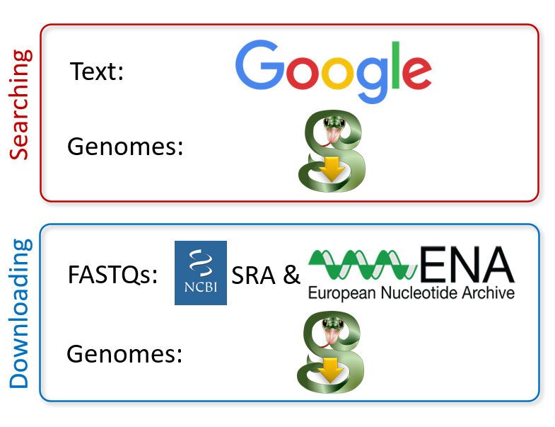

---
author-meta:
- Siebren Frolich
- Maarten van der Sande
- Simon van Heeringen
bibliography:
- content/manual-references.json
date-meta: '2021-03-24'
header-includes: '<!--

  Manubot generated metadata rendered from header-includes-template.html.

  Suggest improvements at https://github.com/manubot/manubot/blob/master/manubot/process/header-includes-template.html

  -->

  <meta name="dc.format" content="text/html" />

  <meta name="dc.title" content="Jumpstart your genomics pipelines with genomepy" />

  <meta name="citation_title" content="Jumpstart your genomics pipelines with genomepy" />

  <meta property="og:title" content="Jumpstart your genomics pipelines with genomepy" />

  <meta property="twitter:title" content="Jumpstart your genomics pipelines with genomepy" />

  <meta name="dc.date" content="2021-03-24" />

  <meta name="citation_publication_date" content="2021-03-24" />

  <meta name="dc.language" content="en-US" />

  <meta name="citation_language" content="en-US" />

  <meta name="dc.relation.ispartof" content="Manubot" />

  <meta name="dc.publisher" content="Manubot" />

  <meta name="citation_journal_title" content="Manubot" />

  <meta name="citation_technical_report_institution" content="Manubot" />

  <meta name="citation_author" content="Siebren Frolich" />

  <meta name="citation_author_institution" content="Department of Molecular Developmental Biology, Radboud University" />

  <meta name="citation_author_orcid" content="0000-0001-6925-8446" />

  <meta name="citation_author" content="Maarten van der Sande" />

  <meta name="citation_author_institution" content="Department of Molecular Developmental Biology, Radboud University" />

  <meta name="citation_author_orcid" content="0000-0001-7803-1526" />

  <meta name="twitter:creator" content="@MaartenvdSande" />

  <meta name="citation_author" content="Simon van Heeringen" />

  <meta name="citation_author_institution" content="Department of Molecular Developmental Biology, Radboud University" />

  <meta name="citation_author_orcid" content="0000-0002-0411-3219" />

  <meta name="twitter:creator" content="@svheeringen" />

  <link rel="canonical" href="https://vanheeringen-lab.github.io/genomepy_manuscript/" />

  <meta property="og:url" content="https://vanheeringen-lab.github.io/genomepy_manuscript/" />

  <meta property="twitter:url" content="https://vanheeringen-lab.github.io/genomepy_manuscript/" />

  <meta name="citation_fulltext_html_url" content="https://vanheeringen-lab.github.io/genomepy_manuscript/" />

  <meta name="citation_pdf_url" content="https://vanheeringen-lab.github.io/genomepy_manuscript/manuscript.pdf" />

  <link rel="alternate" type="application/pdf" href="https://vanheeringen-lab.github.io/genomepy_manuscript/manuscript.pdf" />

  <link rel="alternate" type="text/html" href="https://vanheeringen-lab.github.io/genomepy_manuscript/v/3707ceba158e828d04fc7ce0dd49e1c7909c3d40/" />

  <meta name="manubot_html_url_versioned" content="https://vanheeringen-lab.github.io/genomepy_manuscript/v/3707ceba158e828d04fc7ce0dd49e1c7909c3d40/" />

  <meta name="manubot_pdf_url_versioned" content="https://vanheeringen-lab.github.io/genomepy_manuscript/v/3707ceba158e828d04fc7ce0dd49e1c7909c3d40/manuscript.pdf" />

  <meta property="og:type" content="article" />

  <meta property="twitter:card" content="summary_large_image" />

  <meta property="og:image" content="https://github.com/vanheeringen-lab/genomepy_manuscript/raw/3707ceba158e828d04fc7ce0dd49e1c7909c3d40/content/images/thumbnail-505x640.png" />

  <meta property="twitter:image" content="https://github.com/vanheeringen-lab/genomepy_manuscript/raw/3707ceba158e828d04fc7ce0dd49e1c7909c3d40/content/images/thumbnail-505x640.png" />

  <link rel="icon" type="image/png" sizes="192x192" href="https://manubot.org/favicon-192x192.png" />

  <link rel="mask-icon" href="https://manubot.org/safari-pinned-tab.svg" color="#ad1457" />

  <meta name="theme-color" content="#ad1457" />

  <!-- end Manubot generated metadata -->'
keywords:
- bioinformatics
- reproducible-research
- genomics
- tools
lang: en-US
manubot-clear-requests-cache: false
manubot-output-bibliography: output/references.json
manubot-output-citekeys: output/citations.tsv
manubot-requests-cache-path: ci/cache/requests-cache
title: Jumpstart your genomics pipelines with genomepy
...

<small><em>
This manuscript
([permalink](https://vanheeringen-lab.github.io/genomepy_manuscript/v/3707ceba158e828d04fc7ce0dd49e1c7909c3d40/))
was automatically generated
from [vanheeringen-lab/genomepy_manuscript@3707ceb](https://github.com/vanheeringen-lab/genomepy_manuscript/tree/3707ceba158e828d04fc7ce0dd49e1c7909c3d40)
on March 24, 2021.
</em></small>

## Authors

+ **Siebren Frolich** 
    {.inline_icon}
    [0000-0001-6925-8446](https://orcid.org/0000-0001-6925-8446)
    · {.inline_icon}
    [siebrenf](https://github.com/siebrenf) 
  <small>
     Department of Molecular Developmental Biology, Radboud University
  </small>

+ **Maarten van der Sande** 
    {.inline_icon}
    [0000-0001-7803-1526](https://orcid.org/0000-0001-7803-1526)
    · {.inline_icon}
    [Maarten-vd-Sande](https://github.com/Maarten-vd-Sande)
    · {.inline_icon}
    [MaartenvdSande](https://twitter.com/MaartenvdSande) 
  <small>
     Department of Molecular Developmental Biology, Radboud University
  </small>

+ **Simon van Heeringen** 
    {.inline_icon}
    [0000-0002-0411-3219](https://orcid.org/0000-0002-0411-3219)
    · {.inline_icon}
    [simonvh](https://github.com/simonvh)
    · {.inline_icon}
    [svheeringen](https://twitter.com/svheeringen) 
  <small>
     Department of Molecular Developmental Biology, Radboud University
  </small>

## Abstract {.page_break_before}
Analyzing genomics data, such as ATAC, ChIP and RNA-sequencing, requires multiple types of genomic data, such as genome sequence and gene annotations.
These resources can generally be retrieved from multiple organizations, where they exist at multiple versions, and may have been generated with varying methods.
Which set of genomic data to use depends on the context of the research, such as collaboration partners, data reuse or the quality of the genomic data.
Many of the bioinformatic workflows and pipelines available to date require the user to make this informed decision and supply the genomic data manually.
Obtaining this data can be a tedious and error-prone process and does not allow for full computational reproducibility.

Here we present genomepy, a quality-of-life enhancement tool, that can navigate the genome databases of Ensembl, UCSC and NCBI.
Genomepy can search and install genome sequences and gene annotation data from these providers in a consistent, reproducible and documented manner.
The search function retrieves genomes related to the search term, and can do so for one or all providers to allow the user to make an informed decision.
The install function downloads a specified genome with sensible defaults, while providing full control to advanced features.
Additionally, gene annotations can be downloaded and converted to commonly used formats, with built-in checks for compatibility with the genome.
Genomepy can optionally create genome indexes for commonly used aligners, including splice-aware aligners utilizing both genome and gene annotations.
Genomes and gene annotations not available on supported databases can be processed by genomepy as well, providing a consistent workflow with any genome.

Genomepy provides this functionality and more via command line interface and Python application programming interface, aimed at easy of use and integration in automated pipelines.

{#fig:compare height="500px" width="500"px}

## Introduction
As high-throughput sequencing matured over the past decade and a half, the size and amount of sequencing data has exploded.
Over the past five years, the number of datasets published on the NCBI GEO database increased by an average of 2000 per year, while the number of samples increased by 100.000 per year @pmc:PMC3531084.
This explosion of data highlights the need for scalable, robust and automatable methods for data processing and analysis.

A large amount of bioinformatics tools have been created to facilitate this process, including (pre)processing tools, analysis tools and workflow managers to link these tools together (such as the snakemake wrapper @https://snakemake-wrappers.readthedocs.io/en/stable/wrappers/genomepy.html).
However, not all input data can be obtained fully automatic.
Notably the genomic data, which includes the genome assembly, gene annotation and derived files.
These data can be obtained from a variety of different providers.
These include three major genome providers, Ensembl @https://doi.org/10.1093/nar/gkz966, UCSC @doi:10.1101/gr.229102 and NCBI @pmc:PMC308837,
and many niche providers, such as flybase @https://doi.org/10.1093/nar/gky1003, wormbase @https://doi.org/10.1093/nar/gkz920 or xenbase @doi:10.1093/nar/gkx936.
Each provider has a different method of generating genome assemblies and gene annotations, which can affect available data formats, naming schema, information density, as well as availability, accessibility and relevance.
The differences between these data impact the compatibility of the reference data with research tools @https://doi.org/10.1186/s12864-015-1308-8, other reference databases, and other research.
Therefore, the choice of provider and reference data is of significant importance.

In order to assist in searching through genome providers for, and the processing of genomic data, we developed genomepy.
The genomepy search function returns all genomes containing a search term in their name, description or accession identifier, as well as all genomes matching a taxonomy identifier.
The genomepy install function retrieves the specified genomic data of the specified genome assembly, and processed the output for downstream use.
These methods are available via the command line interface and Python application programming interface for easy use and incorporation in automated workflows.

{#fig:flow height="400px" width="600"px}

{#fig:code height="350px" width="500"px}

## Related Work
Ensembl, UCSC and NCBI all support downloading from their individual databases via accessible FTP archives, web portals, and REST APIs.
To access these databases programmatically, there exists several external tools, such as the ncbi-genome-download tool @https://github.com/kblin/ncbi-genome-download and ucsc-genomes-downloader @https://pypi.org/project/ucsc-genomes-downloader.
However, to our knowledge no tool exists that can consistently search or download from all three major genome providers.

There are several existing tools for reproducibly sharing reference data between projects.
These data management tools accept reference data and derived assets such as aligner indexes from any source, such as iGenomes @https://support.illumina.com/sequencing/sequencing_software/igenome.html, refGenie @https://doi.org/10.1093/gigascience/giz149 and Go Get Data @https://doi.org/10.1101/2020.09.10.291377.
These tools excel in their ability to reproducibly share data, a feature which is not present in genomepy, and can be used to obtain and manage previously generated data with ease.
However, these tools require the user to supply the reference data to any new assembly (such as non-model organisms), new assembly version (such as the latest patch of the human genome) or in some cases assets (such as an aligner index not present in the hosted data).

We conclude that there is a need for a tool that can assist in obtaining and preparing genomic data for downstream analysis.
This includes downloading the data, error checking (and if possible correcting) genome and gene annotations, and outputting data types commonly used in bioinformatics tools.
Genomepy was created to fit this need, while also providing an overview of available choices, and a framework that facilitates the downstream use of the data.

## genomepy
The core functionality of genomepy is to search, download and prepare genomes and gene annotations.
These functions are split over two command line functions: `genomepy search` and `genomepy install`.

Search will query the three major providers for a given search term, with the option query only one specified provider.
Genomepy can search for text terms present in genome names or descriptions, taxonomy identifiers and accession numbers, and will automatically detect which is used in the search term.
The search results are returned with available metadata for review.

When an assembly has been selected, the name (as returned from the search function) can be passed to the install function.
The files will be downloaded from the major provider that hosts it.
Users can optionally specify a provider if the data is available on multiple.
Alternatively, if the assembly originates from another source, the url to the genome can be passed.
Next, the genome assembly is downloaded with the desired sequence masking level [@http://repeatmasker.org; @doi:10.1089/cmb.2006.13.1028].
By default soft masked genomes (repetitive sequences written in lower case) are downloaded, but unmasked or hard masked (repetitive sequences written as Ns) can be obtained as well.
If the provider does not have the genome at this masking level, genomepy will edit the FASTA to match.

Reference assemblies often contain alternate sequences to reflect biological diversity.
For the purpose of sequence alignment however, the best results are obtained if there is one reference per nucleotide.
Therefore genomepy filters out alternative regions, unless specified otherwise.
Additionally, regex filters may be passed to either include or exclude contigs (chromosomes, scaffolds, etc.) by name.
For instance to filter out (or filter for) chromosomes, unplaced-, unknown- or mitochondrial sequences.

Once processing is performed, genomepy generates several commonly used support files.
The genome is indexed using pyfaidx @https://doi.org/10.7287/peerj.preprints.970v1, and contig sizes and contig gap sizes are stored in separate files.

If specified, genomepy will attempt to download a gene annotation:
If available, the annotation is processed to the commonly used GTF and BED output formats.
Afterward, contig names between the genome and gene annotation are checked for compatibility.
Should these mismatch, genomepy will attempt to match the names in the annotations to those in the genome.

For data provenance and reproducibility, a README file is kept with the output which logs the URLs to the source files, the steps performed, and contigs filtered out.

Genomepy facilitates several optional processing steps via plugins.
Using the command line, these options can be inspected and toggled with the `genomepy plugin` function.

The blacklist plugin downloads blacklists by the Kundaje lab @https://doi.org/10.1038/s41598-019-45839-z for the supported UCSC genomes (and GRCh38).
The other plugins currently all support the generation of aligner indexes.
These include DNA aligner indexes for Bowtie2 @https://doi.org/10.1038/nmeth.1923, BWA @https://doi.org/10.1093/bioinformatics/btp324, GMAP @https://doi.org/10.1093/bioinformatics/bti310 or Minimap2 @https://doi.org/10.1093/bioinformatics/bty191, and splice-aware aligners such as STAR @https://doi.org/10.1093/bioinformatics/bts635 and HISAT2 @https://doi.org/10.1038/nmeth.3317.

Once the install function has run with one or more aligner plugins, the genomic data is ready for alignment and analysis.

## Conclusion
Obtaining suitable genomic data is a principal step in any genomics project.
Genomepy was developed to provide a consistent overview of genomes on the three major providers, and reproducibly download and process genomic data ready for downstream use.
Using genomepy, a project can utilize genomes from any provider and expect consistent output with data from a major provider or otherwise.
This allows genomepy to automate a step in genomic data preprocessing that was required to be performed by hand.
Additionally, it facilitates downstream analysis, by setting up paths to the genome FASTA file, providing genome metadata within the Python Genome object and generating support files.
Combined, these features make genomepy ideal for integration in automated sequencing workflows, as demonstrated in seq2science @doi:10.5281/zenodo.3921913, paving the way for robust and reproducible analysis.

## Code availability
Genomepy can be installed using [Bioconda](https://anaconda.org/bioconda/genomepy) and [Pip](https://pypi.org/project/genomepy/).
Code and full documentation are available at [https://github.com/vanheeringen-lab/genomepy](https://github.com/vanheeringen-lab/genomepy).

## References {.page_break_before}

<!-- Explicitly insert bibliography here -->

