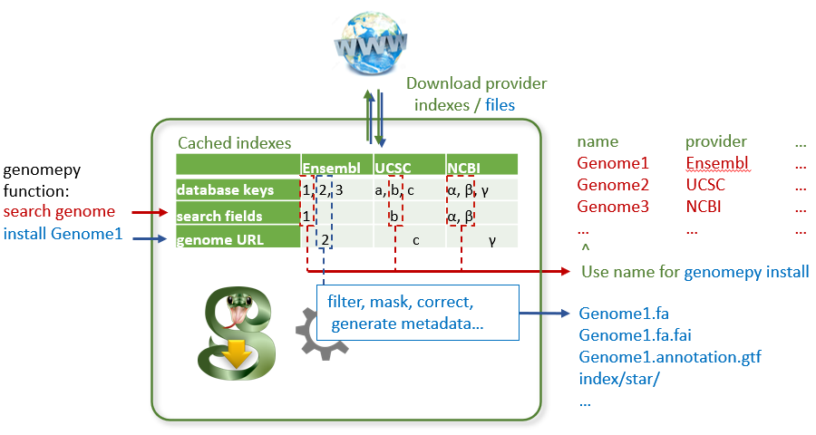
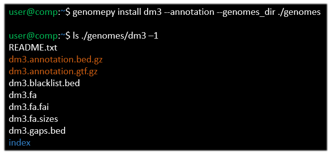

---
author-meta:
- Siebren Frolich
- Maarten van der Sande
- Simon van Heeringen
bibliography:
- content/manual-references.json
date-meta: '2021-03-12'
header-includes: '<!--

  Manubot generated metadata rendered from header-includes-template.html.

  Suggest improvements at https://github.com/manubot/manubot/blob/master/manubot/process/header-includes-template.html

  -->

  <meta name="dc.format" content="text/html" />

  <meta name="dc.title" content="Jumpstart your genomics pipelines with genomepy" />

  <meta name="citation_title" content="Jumpstart your genomics pipelines with genomepy" />

  <meta property="og:title" content="Jumpstart your genomics pipelines with genomepy" />

  <meta property="twitter:title" content="Jumpstart your genomics pipelines with genomepy" />

  <meta name="dc.date" content="2021-03-12" />

  <meta name="citation_publication_date" content="2021-03-12" />

  <meta name="dc.language" content="en-US" />

  <meta name="citation_language" content="en-US" />

  <meta name="dc.relation.ispartof" content="Manubot" />

  <meta name="dc.publisher" content="Manubot" />

  <meta name="citation_journal_title" content="Manubot" />

  <meta name="citation_technical_report_institution" content="Manubot" />

  <meta name="citation_author" content="Siebren Frolich" />

  <meta name="citation_author_institution" content="Department of Molecular Developmental Biology, Radboud University" />

  <meta name="citation_author_orcid" content="0000-0001-6925-8446" />

  <meta name="citation_author" content="Maarten van der Sande" />

  <meta name="citation_author_institution" content="Department of Molecular Developmental Biology, Radboud University" />

  <meta name="citation_author_orcid" content="0000-0001-7803-1526" />

  <meta name="twitter:creator" content="@MaartenvdSande" />

  <meta name="citation_author" content="Simon van Heeringen" />

  <meta name="citation_author_institution" content="Department of Molecular Developmental Biology, Radboud University" />

  <meta name="citation_author_orcid" content="0000-0002-0411-3219" />

  <meta name="twitter:creator" content="@svheeringen" />

  <link rel="canonical" href="https://vanheeringen-lab.github.io/genomepy_manuscript/" />

  <meta property="og:url" content="https://vanheeringen-lab.github.io/genomepy_manuscript/" />

  <meta property="twitter:url" content="https://vanheeringen-lab.github.io/genomepy_manuscript/" />

  <meta name="citation_fulltext_html_url" content="https://vanheeringen-lab.github.io/genomepy_manuscript/" />

  <meta name="citation_pdf_url" content="https://vanheeringen-lab.github.io/genomepy_manuscript/manuscript.pdf" />

  <link rel="alternate" type="application/pdf" href="https://vanheeringen-lab.github.io/genomepy_manuscript/manuscript.pdf" />

  <link rel="alternate" type="text/html" href="https://vanheeringen-lab.github.io/genomepy_manuscript/v/0587cec0d9bd3dad0a58a6f4f8824113a3357b05/" />

  <meta name="manubot_html_url_versioned" content="https://vanheeringen-lab.github.io/genomepy_manuscript/v/0587cec0d9bd3dad0a58a6f4f8824113a3357b05/" />

  <meta name="manubot_pdf_url_versioned" content="https://vanheeringen-lab.github.io/genomepy_manuscript/v/0587cec0d9bd3dad0a58a6f4f8824113a3357b05/manuscript.pdf" />

  <meta property="og:type" content="article" />

  <meta property="twitter:card" content="summary_large_image" />

  <meta property="og:image" content="https://github.com/vanheeringen-lab/genomepy_manuscript/raw/0587cec0d9bd3dad0a58a6f4f8824113a3357b05/content/images/thumbnail-505x640.png" />

  <meta property="twitter:image" content="https://github.com/vanheeringen-lab/genomepy_manuscript/raw/0587cec0d9bd3dad0a58a6f4f8824113a3357b05/content/images/thumbnail-505x640.png" />

  <link rel="icon" type="image/png" sizes="192x192" href="https://manubot.org/favicon-192x192.png" />

  <link rel="mask-icon" href="https://manubot.org/safari-pinned-tab.svg" color="#ad1457" />

  <meta name="theme-color" content="#ad1457" />

  <!-- end Manubot generated metadata -->'
keywords:
- bioinformatics
- reproducible-research
- genomics
- tools
lang: en-US
manubot-clear-requests-cache: false
manubot-output-bibliography: output/references.json
manubot-output-citekeys: output/citations.tsv
manubot-requests-cache-path: ci/cache/requests-cache
title: Jumpstart your genomics pipelines with genomepy
...


<small><em>
This manuscript
([permalink](https://vanheeringen-lab.github.io/genomepy_manuscript/v/0587cec0d9bd3dad0a58a6f4f8824113a3357b05/))
was automatically generated
from [vanheeringen-lab/genomepy_manuscript@0587cec](https://github.com/vanheeringen-lab/genomepy_manuscript/tree/0587cec0d9bd3dad0a58a6f4f8824113a3357b05)
on March 12, 2021.
</em></small>

## Authors


+ **Siebren Frolich**<br>
    {.inline_icon}
    [0000-0001-6925-8446](https://orcid.org/0000-0001-6925-8446)
    · {.inline_icon}
    [siebrenf](https://github.com/siebrenf)<br>
  <small>
     Department of Molecular Developmental Biology, Radboud University
  </small>

+ **Maarten van der Sande**<br>
    {.inline_icon}
    [0000-0001-7803-1526](https://orcid.org/0000-0001-7803-1526)
    · {.inline_icon}
    [Maarten-vd-Sande](https://github.com/Maarten-vd-Sande)
    · {.inline_icon}
    [MaartenvdSande](https://twitter.com/MaartenvdSande)<br>
  <small>
     Department of Molecular Developmental Biology, Radboud University
  </small>

+ **Simon van Heeringen**<br>
    {.inline_icon}
    [0000-0002-0411-3219](https://orcid.org/0000-0002-0411-3219)
    · {.inline_icon}
    [simonvh](https://github.com/simonvh)
    · {.inline_icon}
    [svheeringen](https://twitter.com/svheeringen)<br>
  <small>
     Department of Molecular Developmental Biology, Radboud University
  </small>


## Abstract {.page_break_before}

### Summary
Analyzing genomics data, such as ATAC, ChIP and RNA-sequencing, requires multiple types of genomic data, such as genome sequence and gene annotations.
These resources can generally be retrieved from multiple organizations, where they exist at multiple versions, and may have been generated with varying methods.
Which set of genomic data to use depends on the context of the research, such as collaboration partners, data reuse or the quality of the genomic data.
Many of the bioinformatic workflows and pipelines available to date require the user to make this informed decision and supply the genomic data manually.
Obtaining this data can be a tedious and error-prone process and does not allow for full computational reproducibility.

Here we present genomepy, a quality-of-life enhancement tool, that can navigate the genome databases of Ensembl, UCSC and NCBI.
Genomepy can search and install genome sequences and gene annotation data from these providers in a consistent, reproducible and documented manner.
The search function retrieves genomes related to the search term, and can do so for one or all providers to allow the user to make an informed decision.
The install function downloads a specified genome with sensible defaults, while providing full control to advanced features.
Additionally, gene annotations can be downloaded and converted to commonly used formats, with built-in checks for compatibility with the genome.
Genomepy can optionally create genome indexes for commonly used aligners, including splice-aware aligners utilizing both genome and gene annotations.
Genomes and gene annotations not available on supported databases can be processed by genomepy as well, providing a consistent workflow with any genome.

Genomepy provides this functionality and more via command line interface and Python application programming interface, aimed at easy of use and integration in automated pipelines.

{#fig:compare height="500px" width="500"px}

### Availability and implementation
Genomepy can be installed using [Bioconda](https://anaconda.org/bioconda/genomepy) and [Pip](https://pypi.org/project/genomepy/), and the code is available at [https://github.com/vanheeringen-lab/genomepy](https://github.com/vanheeringen-lab/genomepy).


## Introduction
As high-throughput sequencing matured over the past decade and a half, the size and amount of sequencing data has exploded.
Over the past five years, the number of datasets published on the NCBI GEO database increased by an average of 2000 per year, while the number of samples increased by 100.000 per year @pmc:PMC3531084.
This explosion of data highlights the need for scalable, robust and automatable methods for data processing and analysis.

A large amount of bioinformatics tools have been created to facilitate this process, including (pre)processing tools, analysis tools and workflow managers to link these tools together (such as the snakemake wrapper @https://snakemake-wrappers.readthedocs.io/en/stable/wrappers/genomepy.html).
Together, this allows the human component to shift towards management, reducing both human labor and error.
However, not all input data can be obtained fully automatic.
Notably the genomic data, which includes the genome assembly, gene annotation and derived files.
<!--  -->
<!-- In the case of genomic sequencing preprocessing for instance, a genome assembly and gene annotation are required for sequence alignment. # TODO: example -->
<!-- Likewise, downstream analysis require genomic data, such as the genome assembly or indexes derived therefrom. # TODO: example -->
<!--  -->
<!--  -->
<!--  -->
<!-- problem one: multiple sources with different output assembly -->
<!-- problem two: choice of assembly is important for you -->
<!--  -->
<!-- solution one: learn all the differences -->
<!-- solution two: get the one that fits you -->
<!--  -->
These data can be obtained from a variety of different providers.
These include three major genome providers, Ensembl @https://doi.org/10.1093/nar/gkz966, UCSC @doi:10.1101/gr.229102 and NCBI @pmc:PMC308837,
and many niche providers, such as flybase @https://doi.org/10.1093/nar/gky1003, wormbase @https://doi.org/10.1093/nar/gkz920 or xenbase @doi:10.1093/nar/gkx936.
<!-- Providers range from individual organisations to collaborators in larger projects, such as the ENCODE project, # TODO: source -->
<!-- each with their workflow for generating genomic data.  -->
<!--  -->
<!-- Ensembl uses their in-house workflow to add or update genomes and gene annotations in a three-month production cycle @https://ensembl.org/info/about/release_cycle.html. -->
<!-- As a results, Ensembl provides detailed gene annotations on mature genome assemblies that update frequently. -->
<!-- Downside to Ensembl system include their chromosome naming scheme (e.g. "1" for chromosome 1) which clashes with several common bioinformatics tools, or that prior releases of genomic data are buried in their ever growing archive. -->
<!--  -->
<!-- UCSC hosts and maintains a modest set of reference genomes. -->
<!-- Gene annotations for these genomes are generated through a variety of methods, including the Ensembl and NCBI workflow, as well as their own. -->
<!-- However, not every version of these gene annotations conforms to the output format. -->
<!--  -->
<!-- The NCBI database accepts submissions from the Genome Reference Consortium as well as individuals. -->
<!-- In addition to reference assemblies by the reference consortium, uploads by individual groups often provide a trove of different strains per species. -->
<!-- For instance, 946 different strains of Homo sapiens and 848 strains of Saccharomyces cerevisiae are available from NCBI. -->
<!-- As a result of the open submission system, NCBI updates frequently, and often provides the latest version of an assembly before the other providers do. -->
<!-- However, as an upload may contain either genome assembly, gene annotation, or both, the assembly data can be incomplete, and of varying levels of maturity. -->
<!--  -->
<!-- Furthermore, there are many species specific providers, such as flybase @https://doi.org/10.1093/nar/gky1003, wormbase @https://doi.org/10.1093/nar/gkz920 or xenbase @doi:10.1093/nar/gkx936. -->
<!--  -->
<!--| Provider | Assemblies |-->
<!--|----------|------------|-->
<!--| Ensembl bacteria (excluded in the other number) | 43778 |-->
<!--| NCBI bacteria    (included in the other number) | 28631 |-->
<!--  -->
<!-- | Provider | Assemblies | -->
<!-- |----------|------------| -->
<!-- | UCSC |  213 | -->
<!-- | Ensembl |  1741 | -->
<!-- | NCBI | 878821 | -->
<!--  -->
<!-- Table: Available genome assemblies per provider. -->
<!-- Estimated by querying the provider REST API (assembly summaries for NCBI) for all unique assembly names. -->
<!-- Ensembl genomes are excluding 43778 bacteria genomes not available programmatically. -->
<!-- {#tbl:providers} -->
<!--  -->
Each provider has a different method of generating genome assemblies and gene annotations, which can affect available data formats, naming schema, information density, as well as availability, accessibility and relevance.
Take the major providers:
Ensembl hosts a large database of curated genomes, most of which are actively maintained.
They provide gene annotation in commonly used data formats (GTF, GFF3 and BED12), and their GTF files contain the most metadata af the mayor providers.
However, Ensembl uses a chromosome naming scheme that clashes with several bioinformatics tools (e.g. "1" for chromosome 1).
<!-- Take the major providers: -->
<!-- Ensembl regularly updates their curated genome data with a rich and consistent data format, but with a chromosome naming scheme that clashes with several bioinformatics tools (e.g. "1" for chromosome 1). -->
NCBI hosts the largest database by accepting submissions from the Genome Reference Consortium as well as from individuals.
As a result, the database provides a trove of data with varying quality and completeness.
Finally, UCSC hosts and maintains a modest set of reference genomes, with gene annotations derived from multiple pipelines for most.
However, their gene annotations have inconsistent data formats, which also clashes with bioinformatics tools (e.g. the gene names and gene identifiers are mixed).
These differences impact the compatibility of the reference data with research tools @https://doi.org/10.1186/s12864-015-1308-8, other reference databases and other research.
Therefore, the choice of provider and reference data is of significant importance.

Making an informed decision requires an overview of available options.
This is achieved by determining which providers host the genomic data of interest, then which genomic data is most suitable, then downloading and processing the genomic data and finally starting your analysis.
<!-- Such an overview could be obtained by checking each provider separately, then download and process the data manually. -->
Performing these steps manually creates room for human error in the locating, processing and reporting of these steps as well as the reasoning behind them.
For the sake of sanity and reproducibility, it would be better if this could be done in a standardized system.

In order to assist in searching through genome providers for, and the processing of genomic data, we developed genomepy.
Using the search function one can get an overview of all genomes containing the search term in their name, description or accession identifier, as well as all genomes matching a taxonomy identifier.
The search function can provider this overview for each of the majors providers, Ensembl, UCSC, NCBI or all three.
Once a selection is made the genome and gene annotations can be downloaded and prepared for use with the install function (figure {@fig:flow}).
The install function automatically performs processing of the genomic data, including genome indexing with pyfaidx @https://doi.org/10.7287/peerj.preprints.970v1, generating support files (chromosome sizes and sequencing gaps), matching chromosome names between genome and gene annotation, and optional aligner index generation).
Using the command line interface will automatically log which of these features is used.
Once downloaded genomepy installs the path to genome FASTA file into command line variables, for quick reference in downstream tools.
Using the Python application programming interface the genomepy Genome object can be used to similarly access the metadata of the installed genomic data, such as the location and content additional data files (chromosome sizes, gene annotation files).
Both interfaces are develop for incorporated in workflows to automate the downloading and processing steps.

{#fig:flow height="400px" width="600"px}

{#fig:code height="350px" width="500"px}

<!--  -->
<!-- To this end we developed genomepy. -->
<!-- Genomepy is a tool with both command line interface and Python application programming interface, which can be called to search one or all three providers at once. -->
<!-- Using the search function one can get an overview of all genomes containing the search term in their name, description or accession identifier, as well as all genomes matching a taxonomy identifier. -->
<!-- Once a selection is made the genome and gene annotations can be downloaded and prepared for use with the install function. -->
<!-- This includes automatic preparation for aligners (genome indexing with pyfaidx @https://doi.org/10.7287/peerj.preprints.970v1, generating support files (chromosome sizes and gaps), matching chromosome names between genome and gene annotation and optional aligner index generation). -->
<!-- Which of these features is used is automatic logged for reproducibility. -->
<!-- Because of the multiple interfaces, genomepy can be used in workflows to automate these steps. -->
<!--  -->
<!-- {#fig:workflow_w_genomepy height="500px" width="500"px}  -->

## Related Work
Ensembl, UCSC and NCBI all support downloading from their individual databases via accessible FTP archives, web portals, and REST APIs.
To access these databases programmatically, there exists several external tools, such as the ncbi-genome-download tool @https://github.com/kblin/ncbi-genome-download and ucsc-genomes-downloader @https://pypi.org/project/ucsc-genomes-downloader.
However, to our knowledge no tool exists that can consistently search or download from all three major genome providers.

There are several existing tools for reproducibly sharing reference data between projects.
These data management tools accept reference data and derived assets such as aligner indexes from any source, such as iGenomes @https://support.illumina.com/sequencing/sequencing_software/igenome.html, refGenie @https://doi.org/10.1093/gigascience/giz149 and Go Get Data @https://doi.org/10.1101/2020.09.10.291377.
These tools excel in their ability to reproducibly share data, a feature which is not present in genomepy, and can be used to obtain and manage previously generated data with ease.
However, these tools require the user to supply the reference data to any new assembly (such as non-model organisms), new assembly version (such as the latest patch of the human genome) or in some cases assets (such as an aligner index not present in the hosted data).
<!-- For these situations, data management tools would be an excellent extension to genomepy. -->
<!--  -->
<!-- In several cases the reference data may not be ready for direct downstream use. -->
<!-- For instance, many assemblies do not contain gene annotations in the correct format for splice-aware aligners. -->
<!-- Furthermore, many gene annotations have contig (chromosomes and scaffolds) names that do not match the names in the reference genome. -->
<!-- Additional steps, including compatibility checks and potentially processing, are required. -->
<!-- Many tools exist to perform these actions, most noteably the UCSC gene annotation conversion tools. -->
<!-- However, it should not bear mentioning that and automated checklist but would be more efficient that a manual one. -->
<!--  -->
<!-- We conclude that there is a need for a tool that can provide an overview of the choices of reference data available, can obtain the specified data, and perform the processing required to utilize the data downstream. -->
<!-- Genomepy was created to fit this need, and does so for both automated and human-supervised workflows. -->

We conclude that there is a need for a tool that can assist in obtaining and preparing genomic data for downstream analysis.
This includes providing an overview of available choices, downloading the data, error checking (and if possible correcting) genome and gene annotations, and outputting data types commonly used in bioinformatics tools.
Genomepy was created to fit this need for both automated and human-operated workflows. Additionally, genomepy provides a framework that facilitates the downstream use of the data.


## genomepy
The core functionality of genomepy is to search, download and prepare genomes and gene annotations.
These functions are split over two command line functions: `genomepy search` and `genomepy install`.

### Search
Search will query the three major providers for a given search term, with the option query only one specified provider.
Genomepy can search for text terms present in genome names or descriptions, taxonomy identifiers and accession numbers, and will automatically detect which is used in the search term.
The search results are returned with available metadata for review.

### Install
When an assembly has been selected, the name (as returned from the search function) can be passed to the install function.
The files will be downloaded from the major provider that hosts it.
Users can optionally specify a provider if the data is available on multiple.
Alternatively, if the assembly originates from another source, the url to the genome can be passed.
<!--  -->
<!-- When an assembly has been selected, the name can be passed to the install function. -->
<!-- If the assembly is available from multiple providers, then specific provider can be passed as well. -->
<!--  -->
<!-- If an assembly from an unsupported provider is preferred, direct download links may be supplied in order to receive the same processing. -->
<!-- This may be useful if the external provider contains a novel or more recent assembly of organisms in their specialized field. -->
<!-- This results in a consistent output from any desired provider. -->
<!--  -->
<!-- The function first downloads the genome assembly with soft masking (repetitive sequences written in lower case). -->
<!-- Sequence masking can be turned off, or set to hard (repetitive sequences written as Ns). -->
Next, the genome assembly is downloaded with the desired sequence masking level [@http://repeatmasker.org; @doi:10.1089/cmb.2006.13.1028].
By default soft masked genomes (repetitive sequences written in lower case) are downloaded, but unmasked or hard masked (repetitive sequences written as Ns) can be obtained as well.
If the provider does not have the genome at this masking level, genomepy will edit the FASTA to match.

Reference assemblies often contain alternate sequences to reflect biological diversity.
For the purpose of sequence alignment however, the best results are obtained if there is one reference per nucleotide.
Therefore genomepy filters out alternative regions, unless specified otherwise.
Additionally, regex filters may be passed to either include or exclude contigs (chromosomes, scaffolds, etc.) by name.
For instance to filter out (or filter for) chromosomes, unplaced-, unknown- or mitochondrial sequences.

Once processing is performed, genomepy generates several commonly used support files.
The genome is indexed using pyfaidx @https://doi.org/10.7287/peerj.preprints.970v1, and contig sizes and contig gap sizes are stored in separate files.

If specified, genomepy will attempt to download a gene annotation:
genomepy will search the database for a GFF, GTF, BED or (for UCSC only) text format gene annotation.
The annotation is then processed to the commonly used GTF and BED output formats using publicly available conversion tools @http://hgdownload.cse.ucsc.edu/admin/exe.
Afterward, contig names between the genome and gene annotation are checked for compatibility.
Should these mismatch, genomepy will attempt to match the names in the annotations to those in the genome.

For data provenance and reproducibility, a README file is kept with the output which logs the URLs to the source files, the steps performed, and contigs filtered out.

### Plugins
Genomepy facilitates several optional processing steps via plugins.
Using the command line, these options can be inspected and toggled with the `genomepy plugin` function.
Enabled plugins will execute upon (re)running the install function.

The blacklist plugin downloads blacklists by the Kundaje lab @https://doi.org/10.1038/s41598-019-45839-z for the supported UCSC genomes (and GRCh38).
If no blacklist is available the program will proceed after giving a warning.

Currently, other plugins support the generation of several popular genome aligners.
These include DNA aligner indexes for Bowtie2 @https://doi.org/10.1038/nmeth.1923, BWA @https://doi.org/10.1093/bioinformatics/btp324, GMAP @https://doi.org/10.1093/bioinformatics/bti310 or Minimap2 @https://doi.org/10.1093/bioinformatics/bty191, and splice-aware aligners such as STAR @https://doi.org/10.1093/bioinformatics/bts635 and HISAT2 @https://doi.org/10.1038/nmeth.3317.
<!-- Genomepy support generation of several popular genome aligners: Bowtie2, BWA, GMAP or Minimap2, and splice-aware aligners such as STAR and HISAT2. -->
The splice-aware aligners function both with and without gene annotations.
Should no gene annotation be downloaded, the program will issue a warning and proceed to generate a splice-unaware index.
<!-- By default genomepy supports multithreading aligner indexing. -->
<!-- Unless specified, up to eight cores are used depending on the number available. -->

<!-- ### Provider indexing -->
<!-- In order to search, genomepy acquires an overview of available assemblies from each supported providers when first required. -->
<!-- For Ensembl and UCSC, this is possible via their REST API. -->
<!-- NCBI does not provide a REST API for their genome database, but their FTP archives contain several assembly overviews. -->
<!-- Each of these databases is converted to a dictionary with the assembly name as key. -->
<!-- The databases are supplied as dictionaries as well, resulting in a nested dictionary. -->
<!-- Each provider uses a different filing system, which genomepy parses to group together similar features. -->
<!-- For instance, NCBI uses two fields for taxonomy identifiers ("species_taxid" and "taxid"), which are both used by genomepy when searching by taxonomy identifier. -->

<!-- The parsed databases are stored in a local cache for seven days in order to balance quick lookups, while staying up to date. -->

<!-- ```python -->
<!-- >>> import genomepy -->
<!-- >>> p = genomepy.ProviderBase.create("ucsc") -->
<!-- Downloading assembly summaries from UCSC -->
<!-- >>> g = p.genomes -->
<!-- >>> next(iter(g)) -->
<!-- 'ailMel1' -->
<!-- >>> g['ailMel1'] -->
<!-- {'description': 'Dec. 2009 (BGI-Shenzhen 1.0/ailMel1)', 'nibPath': '/gbdb/ailMel1', 'organism': 'Panda', 'defaultPos': 'GL192818.1:558576-566855', 'active': 1, 'orderKey': 16070, 'genome': 'Panda', 'scientificName': 'Ailuropoda melanoleuca', 'htmlPath': '/gbdb/ailMel1/html/description.html', 'hgNearOk': 0, 'hgPbOk': 0, 'sourceName': 'BGI-Shenzhen AilMel 1.0 Dec. 2009', 'taxId': 9646} -->
<!-- ``` -->

<!-- ### Command line example -->
<!-- Here we demonstrate a typical example using genomepy. -->
<!-- Commands are indicated by a dollar sign, and standard output was trimmed for brevity. -->

<!-- ```bash -->
<!-- $ genomepy search "drosophila mel" --provider ucsc -->
<!-- name    provider    accession          species                    tax_id    other_info                                   -->
<!-- dm1     UCSC        na                 Drosophila melanogaster    7227      Jan. 2003 (BDGP R3/dm1)                      -->
<!-- dm2     UCSC        na                 Drosophila melanogaster    7227      Apr. 2004 (BDGP R4/dm2)                      -->
<!-- dm3     UCSC        GCA_000001215.2    Drosophila melanogaster    7227      Apr. 2006 (BDGP R5/dm3)                      -->
<!-- dm6     UCSC        GCA_000001215.4    Drosophila melanogaster    7227      Aug. 2014 (BDGP Release 6 + ISO1 MT/dm6)     -->
<!--  ^ -->
<!--  Use name for genomepy install -->

<!-- $ genomepy plugin enable blacklist star -->
<!-- Enabled plugins: blacklist, star -->

<!-- $ genomepy install dm3 --annotation -->
<!-- Downloading genome from UCSC. -->
<!-- Target URL: http://hgdownload.soe.ucsc.edu/goldenPath/dm3/bigZips/chromFa.tar.gz... -->
<!-- Genome download successful, starting post processing... -->

<!-- name: dm3 -->
<!-- local name: dm3 -->
<!-- fasta: /home/siebrenf/.local/share/genomes/dm3/dm3.fa -->
<!-- Downloading annotation from UCSC. -->
<!-- Target URL: http://hgdownload.soe.ucsc.edu/goldenPath/dm3/bigZips/genes/dm3.ensGene.gtf.gz... -->

<!-- Annotation download successful -->
<!-- Creating star index...  -->
<!-- Downloading blacklist http://mitra.stanford.edu/kundaje/akundaje/release/blacklists/dm3-D.melanogaster/dm3-blacklist.bed.gz -->

<!-- $ ls ~/.local/share/genomes/dm3 -->
<!-- dm3.annotation.bed.gz  dm3.annotation.gtf.gz  dm3.blacklist.bed  dm3.fa  dm3.fa.fai  dm3.fa.sizes  dm3.gaps.bed  index  README.txt -->

<!-- $ ls ~/.local/share/genomes/dm3/index -->
<!-- star -->

<!-- $ head ~/.local/share/genomes/dm3/README.txt  -->
<!-- name: dm3 -->
<!-- provider: UCSC -->
<!-- original name: dm3 -->
<!-- original filename: chromFa.tar.gz -->
<!-- assembly_accession: GCA_000001215.2 -->
<!-- tax_id: 7227 -->
<!-- mask: soft -->
<!-- genome url: http://hgdownload.soe.ucsc.edu/goldenPath/dm3/bigZips/chromFa.tar.gz -->
<!-- annotation url: http://hgdownload.soe.ucsc.edu/goldenPath/dm3/bigZips/genes/dm3.ensGene.gtf.gz -->
<!-- sanitized annotation: not required -->
<!-- ``` -->
<!-- ## Python example -->
<!-- The core genomepy functions, such as `search` and `install` are exposed on import. -->
<!-- In order to visualize the install function the individual steps are executed in this example, rather than calling the `genomepy.install()` function directly. -->
<!-- Commands are indicated by `>>>`, and prints were trimmed for brevity. -->

<!-- ```python -->
<!-- >>> import os -->
<!-- >>> import genomepy -->

<!-- >>> for row in genomepy.search("melanogaster", "ucsc"): -->
<!-- >>>     print("\t".join([x.decode('utf-8') for x in row])) -->
<!--      -->
<!-- dm1	UCSC	na	Drosophila melanogaster	7227	Jan. 2003 (BDGP R3/dm1) -->
<!-- dm2	UCSC	na	Drosophila melanogaster	7227	Apr. 2004 (BDGP R4/dm2) -->
<!-- dm3	UCSC	GCA_000001215.2	Drosophila melanogaster	7227	Apr. 2006 (BDGP R5/dm3) -->
<!-- dm6	UCSC	GCA_000001215.4	Drosophila melanogaster	7227	Aug. 2014 (BDGP Release 6 + ISO1 MT/dm6) -->

<!-- >>> p = genomepy.ProviderBase.create("ucsc") -->
<!-- >>> p.download_genome("dm3", annotation=True) -->
<!-- Genome download successful, starting post processing... -->
<!-- name: dm3 -->
<!-- local name: dm3 -->
<!-- fasta: /home/siebrenf/.local/share/genomes/dm3/dm3.fa -->

<!-- >>> genome = genomepy.Genome("dm3") -->
<!-- >>> plugins = genomepy.plugin.init_plugins() -->
<!-- >>> plugins["star"].after_genome_download(genome) -->
<!-- Creating star index...  -->

<!-- >>> plugins["blacklist"].after_genome_download(genome) -->
<!-- Downloading blacklist http://mitra.stanford.edu/kundaje/akundaje/release/blacklists/dm3-D.melanogaster/dm3-blacklist.bed.gz -->

<!-- >>> p.download_annotation("dm3") -->
<!-- Downloading annotation from UCSC. -->
<!-- Target URL: http://hgdownload.soe.ucsc.edu/goldenPath/dm3/bigZips/genes/dm3.ensGene.gtf.gz... -->
<!-- Annotation download successful -->

<!-- >>> genomepy.utils.sanitize_annotation(genome) -->

<!-- >>> path = os.path.expanduser("~/.local/share/genomes/dm3") -->
<!-- >>> os.listdir(path) -->
<!-- ['dm3.annotation.gtf.gz', 'dm3.blacklist.bed', 'dm3.gaps.bed', 'dm3.fa', 'index', 'dm3.annotation.bed.gz', 'README.txt', 'dm3.fa.sizes', 'dm3.fa.fai'] -->
<!-- ``` -->


## Conclusion
<!-- A principal step in all science is making informed decisions. -->
<!-- For genomics projects, choosing a genome to serve as reference assembly is no different. -->
Obtaining suitable genomic data is a principal step in any genomics project.
Genomepy was developed to provide a consistent overview of genomes on the three major providers,
and reproducibly download and process genomic data ready for downstream use.
<!-- offers an overview of the three largest genome providers, serving as a catalyst for this step. -->
<!--  -->
<!-- After choosing an assembly, data must be downloaded and processed for compatibility with downstream tools. -->
<!-- Genomepy provides this functionality, which includes downloading, zipping and unzipping, converting, filtering and altering of the data, while providing logging of the steps undertaken. -->
<!-- Even if the required reference data is not available on the three largest genome providers, genomepy can process external data to provide a consistent output. -->
Using genomepy, a project can utilize genomes from any provider and expect consistent output with data from a major provider or otherwise.
This allows genomepy to automate a step in genomic data preprocessing that was performed by hand prior.
Additionally, it facilitates downstream analysis, by setting up paths to the genome FASTA file, providing genome metadata within the Python Genome object and generating support files.
<!--  -->
<!-- While genomepy makes choices during the processing, each of these can be tuned to the specific needs of a project using the CLI or Python API. -->
Combined, these features make genomepy ideal for integration in automated sequencing workflows, as demonstrated in seq2science @doi:10.5281/zenodo.3921913, paving the way for robust and reproducible analysis.

### Future prospects
<!-- As science strives to become more open, genomepy assists by making the discussed steps easier, and make the output more FAIR @doi:10.1038/sdata.2016.18. -->
Further improvements to openness and reproducibility could be achieved by combining or coupling of genomepy with data management tools such as Go Get Data and RefGenie.
Additionally, further improvements could be made in the ability to specify the assembly version, in order to allow annotations of different versions with an assembly.
<!--  -->
<!-- For these situations, data management tools would be an excellent extension to genomepy. -->
<!-- Simon: Move to future outlook => integration / combination with GGD and RefGenie. In this section you want to convince the reader that there is a gap, and that genomepy fills that specific gap! -->


## Acknowledgements
We thank the Department of Molecular (Developmental) Biology, out github [contributors](https://github.com/vanheeringen-lab/genomepy/graphs/contributors), and issue posters for their patience, feedback and insight.
We thank black, pytest, CodeCoverage and TravisCI for enduring our abuse and teaching us patience.
And finally, we thank Manubot @doi:10.1371/journal.pcbi.1007128 for assisting with this manuscript.

## Code availability
Genomepy can be installed using [Bioconda](https://anaconda.org/bioconda/genomepy) and [Pip](https://pypi.org/project/genomepy/).
The code is available at [https://github.com/vanheeringen-lab/genomepy](https://github.com/vanheeringen-lab/genomepy).

## Supplementary Information
The full genomepy documentation including examples can be viewed [here](https://github.com/vanheeringen-lab/genomepy/blob/master/README.md)


## References {.page_break_before}

<!-- Explicitly insert bibliography here -->
<div id="refs"></div>
